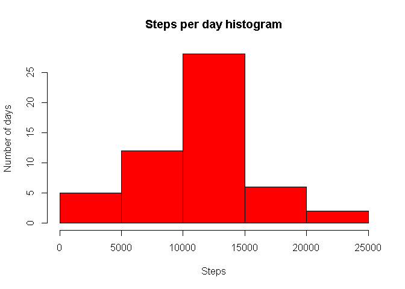
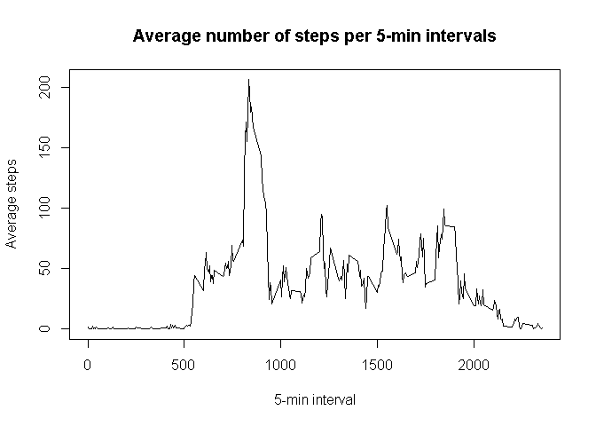
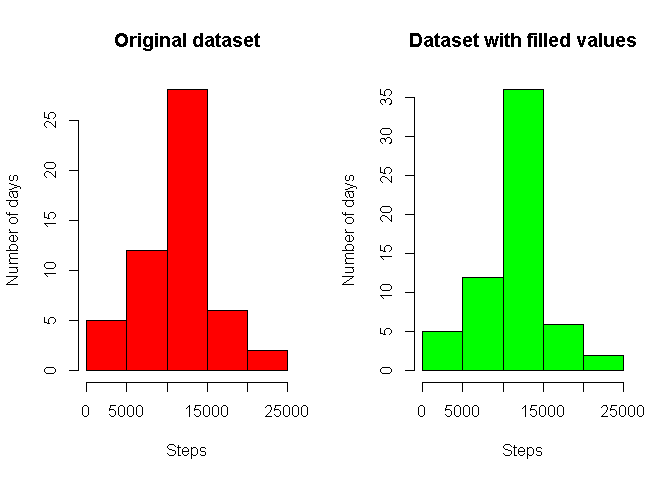
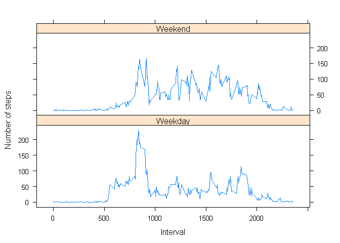

# Reproducible Research: Peer Assessment 1
Miguel A. Regueira  
February 2, 2016  


## Loading and preprocessing the data

The data for this assignment can be downloaded from the course web site:

+ Dataset: [Activity monitoring data](https://d396qusza40orc.cloudfront.net/repdata%2Fdata%2Factivity.zip) [52K]

```r
# Use a temporary file to download the dataset
temp <- tempfile()
download.file("https://d396qusza40orc.cloudfront.net/repdata%2Fdata%2Factivity.zip",temp)
```

This data is unzipped in data folder, if the folder does not exist it is created.

```r
# Create data folder if it doesn't exist
if(!file.exists("./data")){dir.create("./data")}
unzip(temp, exdir = "./data")

# Delete the temporal zip file
unlink(temp)
```

Load data into data frame "activity" and convert to proper types

```r
activity <- read.csv(file = "./data/activity.csv", na.strings = "NA")
activity$date <- as.Date(activity$date)
```

Observing interval values and definition, it can be seen that it represent the time start of 5 minutes period in the format of %H%M, being 0 = 00:00, 5 = 00:05, ..., 100 = 01:00, 105 = 01:05, ..., 2355 = 23:55. A new column with a completed timestamp with previous assuption for the hours and minutes is appended to the data.frame

```r
activity$timestamp <- as.POSIXct(paste(activity$date, sprintf("%04d", activity$interval)), format = "%Y-%m-%d %H%M")
```

The following is a summery of the tidy data frame:


```r
summary(activity)
```

```
##      steps             date               interval     
##  Min.   :  0.00   Min.   :2012-10-01   Min.   :   0.0  
##  1st Qu.:  0.00   1st Qu.:2012-10-16   1st Qu.: 588.8  
##  Median :  0.00   Median :2012-10-31   Median :1177.5  
##  Mean   : 37.38   Mean   :2012-10-31   Mean   :1177.5  
##  3rd Qu.: 12.00   3rd Qu.:2012-11-15   3rd Qu.:1766.2  
##  Max.   :806.00   Max.   :2012-11-30   Max.   :2355.0  
##  NA's   :2304                                          
##    timestamp                  
##  Min.   :2012-10-01 00:00:00  
##  1st Qu.:2012-10-16 05:58:45  
##  Median :2012-10-31 11:57:30  
##  Mean   :2012-10-31 11:30:49  
##  3rd Qu.:2012-11-15 17:56:15  
##  Max.   :2012-11-30 23:55:00  
## 
```


## What is mean total number of steps taken per day?
To respond this question let's us discard NA cases.

```r
complete <- activity[complete.cases(activity),]
```

Now it can be calculated the sum of steps per day (steps).


```r
daily <- aggregate(complete$steps,list(complete$date),sum)
names(daily) <- c("Date","steps")
```

The following is a summary of the daily calculated data:


```r
summary(daily)
```

```
##       Date                steps      
##  Min.   :2012-10-02   Min.   :   41  
##  1st Qu.:2012-10-16   1st Qu.: 8841  
##  Median :2012-10-29   Median :10765  
##  Mean   :2012-10-30   Mean   :10766  
##  3rd Qu.:2012-11-16   3rd Qu.:13294  
##  Max.   :2012-11-29   Max.   :21194
```


With this data a histogram of the number of steps per day can be calculated


```r
hist(x = daily$steps, main = "Steps per day histogram", xlab = "Steps", ylab = "Number of days", col = "red")
```



Now it can be calculated the average number of steps taken per day and the median, the average number of steps taken per day are 10766.1886792453 and the median 10765.

## What is the average daily activity pattern?

To answer this question let's start by calculating the average number of steps per 5-minutes interval across all days.


```r
minAvg <- aggregate(complete$steps,list(complete$interval),mean)
names(minAvg) <- c("interval","mean")
```

The processed data can be better understand as a time series plot. In the following plot can be observed how varies the average number of activities per 5-minutes interval, for example from midnight to 6AM aproximately can be seen almost no activity.


```r
plot(minAvg$interval,minAvg$mean, type = 'l', main = "Average number of steps per 5-min intervals", xlab = "5-min interval", ylab = "Average steps")
```



A clear peak can of activity can be observed around 9 AM, the following code will find which time interval exactly has the highest activity. The maximun average activity happens at 835.

## Imputing missing values

It's important to see the impact of missing values in input data, so let's calculate how many 5-min intervals we have in our dataset, in the original dataset can be found 2304 5-min intervals without data.

We can create another dataset where missing values are filled with the 5-min average across days. The summary of this new dataset can be seen next:


```r
filled <- activity
filled$steps <- mapply(function(x,y) if(is.na(x)){minAvg[minAvg$interval == y,2]}else{x},filled$steps,filled$interval)
summary(filled)
```

```
##      steps             date               interval     
##  Min.   :  0.00   Min.   :2012-10-01   Min.   :   0.0  
##  1st Qu.:  0.00   1st Qu.:2012-10-16   1st Qu.: 588.8  
##  Median :  0.00   Median :2012-10-31   Median :1177.5  
##  Mean   : 37.38   Mean   :2012-10-31   Mean   :1177.5  
##  3rd Qu.: 27.00   3rd Qu.:2012-11-15   3rd Qu.:1766.2  
##  Max.   :806.00   Max.   :2012-11-30   Max.   :2355.0  
##    timestamp                  
##  Min.   :2012-10-01 00:00:00  
##  1st Qu.:2012-10-16 05:58:45  
##  Median :2012-10-31 11:57:30  
##  Mean   :2012-10-31 11:30:49  
##  3rd Qu.:2012-11-15 17:56:15  
##  Max.   :2012-11-30 23:55:00
```

Now lets replot the histogram as the previous one to compare the differences between original data set (left figure) versus filled dataset (right figure).


```r
dailyFilled <- aggregate(filled$steps,list(filled$date),sum)
names(dailyFilled) <- c("date","steps")
par(mfrow = c(1,2))
hist(x = daily$steps, main = "Original dataset", xlab = "Steps", ylab = "Number of days", col = "red")
hist(x = dailyFilled$steps, main = "Dataset with filled values", xlab = "Steps", ylab = "Number of days", col = "green")
```



The mean and median of the modified dataset is as follows: meand = 10766.1886792453 and median = 10766.1886792453. Compared with the original dataset values (mean = 10766.1886792453 and median = 10765) there is a difference in the mean of 0 and in the median -1.1886792452824. 

## Are there differences in activity patterns between weekdays and weekends?

Let's create a new variable in the dataset that reflects if it is a weekday or a weekend day in the dataset with filled-in missing values.


```r
filled$dayType <- sapply(weekdays(filled$timestamp,abbreviate = TRUE), function(x) if(x %in% c("Sat","Sun")) {as.factor("Weekend")} else {as.factor("Weekday")})
```

Now it can be calculated the average steps per 5-min interval and per day type.


```r
timeAvgDayType <- aggregate(filled$steps,list(filled$interval,filled$dayType),mean)
names(timeAvgDayType) <- c("interval","dayType","mean")
```

In the following plot can be seen the times series of the average number of steps per 5-min interval for Weekend and for Weekdays. In there can be seen a different trend between them, in the weekends the activity is more spread along the day while in the weekdays there is a clear peak at aprox 9 AM.


```r
library(lattice)
xyplot(mean ~ interval| dayType, data = timeAvgDayType, type = 'l', layout = c(1,2), ylab = "Number of steps", xlab = "Interval")
```




## R and package versions used

Some information about the packages used, their versions, the R version, environment, etc.


```r
library(devtools)
devtools::session_info()
```

```
## Session info --------------------------------------------------------------
```

```
##  setting  value                       
##  version  R version 3.2.3 (2015-12-10)
##  system   x86_64, mingw32             
##  ui       RTerm                       
##  language (EN)                        
##  collate  English_United States.1252  
##  tz       Europe/Paris                
##  date     2016-02-04
```

```
## Packages ------------------------------------------------------------------
```

```
##  package   * version date       source        
##  devtools  * 1.10.0  2016-01-23 CRAN (R 3.2.3)
##  digest      0.6.9   2016-01-08 CRAN (R 3.2.3)
##  evaluate    0.8     2015-09-18 CRAN (R 3.2.3)
##  formatR     1.2.1   2015-09-18 CRAN (R 3.2.3)
##  htmltools   0.3     2015-12-29 CRAN (R 3.2.3)
##  knitr     * 1.12.3  2016-01-22 CRAN (R 3.2.3)
##  lattice   * 0.20-33 2015-07-14 CRAN (R 3.2.3)
##  magrittr    1.5     2014-11-22 CRAN (R 3.2.3)
##  memoise     1.0.0   2016-01-29 CRAN (R 3.2.3)
##  rmarkdown   0.9.2   2016-01-01 CRAN (R 3.2.3)
##  stringi     1.0-1   2015-10-22 CRAN (R 3.2.3)
##  stringr     1.0.0   2015-04-30 CRAN (R 3.2.3)
##  yaml        2.1.13  2014-06-12 CRAN (R 3.2.3)
```
